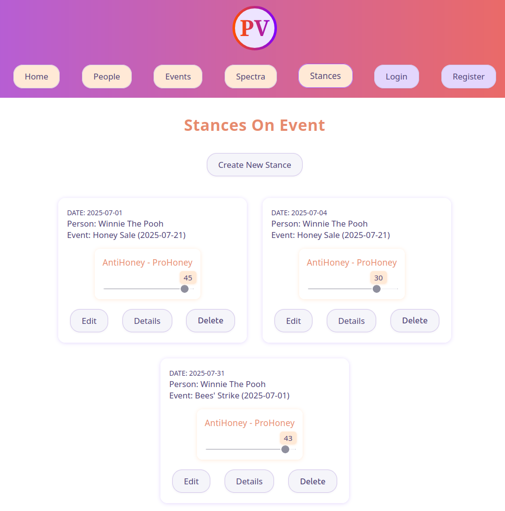
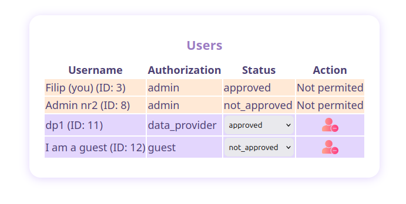

# PolVol

PolVol is a full-stack web platform designed to analyze the volatility of public individuals’ political opinions. Built with React, FastAPI, and SQLite, it includes user authentication, customizable authorization levels, and interactive visualizations of stance consistency.

## Table of Contents

- [Platform concept (just for context)](#platform-concept)
- [Technical documentation](#technical-documentation)

# Platform Concept

The initial idea of this platform was to measure how volatile are political opinions of public individuals (hence the name PolVol). The main goal for me was to give it a meaning, motivating myself to make progress in the first phase of development (it worked). While the political theme adds context, the main goal of this project was to build and deploy a complex full-stack application. Below you will find description of main features of the app (maybe not up to date, so I recommend launching the app).

## Main Features / Components

User (with necessary authorization) can add 3 base data components:

- Person
- Event
- Spectrum (for example "left - right")

Next these elements can be linked via Stance (stance of a person on an event) which has additional attributes of Scores within a Spectrum (from -50 to 50, where -50 in example above would be extremely left-leaning and 50 would be extremely right-leaning). Later average Scores with standard deviation for each Spectrum for each Person can be viewed in person's details page, indicating his/her general position. This (in theory) should objectively show how extreme (average score) and consistent (standard deviation) the person is in their stance within given spectrum.

## Example for Winnie The Pooh

#### People view:


#### Events view:


#### Spectra view:


#### Stances view:



#### Winnie The Pooh Details:


We can see that Winnie is strongly ProHoney (39/50) and is very consistent (8) in his opinions.

# Technical Documentation

## Tech Stack

| Component | Technology          |
| --------- | ------------------- |
| Frontend  | React               |
| Backend   | FastApi             |
| Database  | SQLite (SQLAlchemy) |

## Frontend

React frontend created with Vite. `src` directory is divided by views and data models (`src/Header` for navigation and header, `src/Login` for user login and registration, `src/Person` for CRUD operations on Person data model etc.). Reusable components (tiles, panels, grids, headings etc.) have been created in `src/shared` directory to keep the style consistent across all views and to minimize code repetitions (mostly css). This react app is using React Router to redirect to specific views/components.

## Backend

Backend has been created with Python FastApi and besides standard open endpoints has implemented authentication with JSON Web Token. The api is using Pydantic data models to validate requests and responses.

## Database

SQLite database has been created with Python SQLAlchemy. For each database data model there is matching Pydantic model for validation (`backend.src.models.PersonDB` -> `backend.src.models_validators.Person` etc.).

## Authorization and Authentication

Authentication is managed by JWT. Tokens are automatically removed from database after their expiration datetime is exceeded (with dedicated scheduled reoccurring job).

Authorization is divided into 4 levels specified in `backend.src.models_validators.Authorizations`. The basis of each authorization level are CRUD operation on different models:

```python
class Authorizations(Enum):
    ADMIN = "admin"  # all permissions
    DATA_ANALYST = "data_analyst"  # all below + CU on stances
    DATA_PROVIDER = "data_provider"  # all below + CU events, spectra, people
    GUEST = "guest"  # R all
```

After user registers for a specific authorization level, another user of higher level has to approve him.
Users with higher level of authorization can change status of users with lower level of authorizations and can remove their account


Until approved, user has lowest authorization level (guest). [not yet implemented]

[restrictions for authorization levels not yet implemented]

## Containerization (Docker)

Build docker image for backend:

```bash
cd backend
docker build -t backend:0.0.1
```

Run backend:

```bash
docker run -p 8000:8000 -v polvolVolume:/data backend:0.0.1
```

Build docker image for frontend:

```bash
cd frontend
docker build -t frontend:0.0.1
```

Run frontend:

```bash
docker run -p 5173:80 frontend:0.0.1
```

All services and volumes are referenced in docker compose.yml file.

## Background Jobs [might be changed to Celery + Redis]

Currently there is one background job `backend.src.automation.clear_tokens` implemented running every 2 minutes. It is removing outdated tokens from the database. The job is setup using [schedule](https://pypi.org/project/schedule/) package in Python.

## DevOps (GitHub Actions)

As of today, GitHub Actions has been configured to perform formatting checks on frontend (prettier) and backend code (black), as well as type checks on backend (mypy).

It will be further extended to run unit and module tests on the api, and to build and tag docker images.

## Cloud (Azure)

not yet implemented

The project can be run locally with commands below:

```bash
git clone https://github.com/FilipM13/PolVol.git
docker build -t backend:0.0.1 ./backend
docker build -t frontend:0.0.1 ./frontend
docker compose up
```

The platform is hosted on Azure Container App with Docker compose under [this link]() (not deployed, no valid url).

## LLM (Ollama / HuggingFace)

not yet implemented
