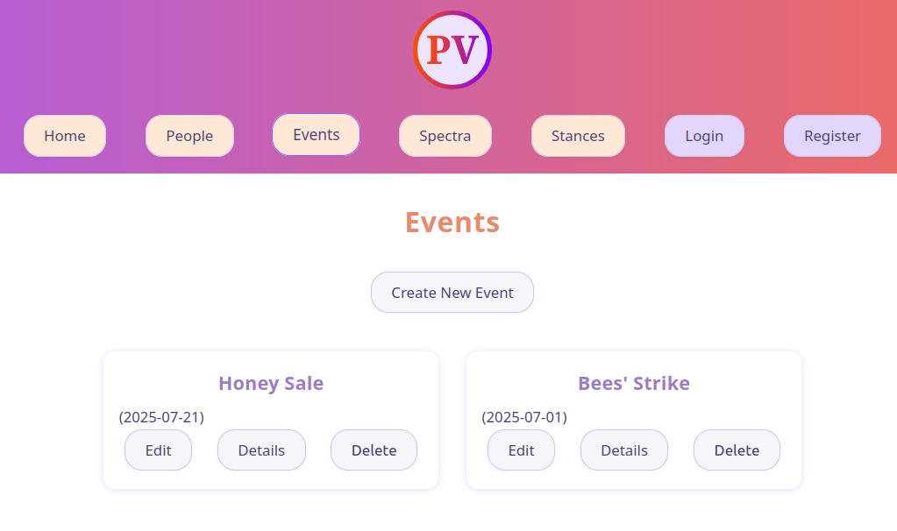
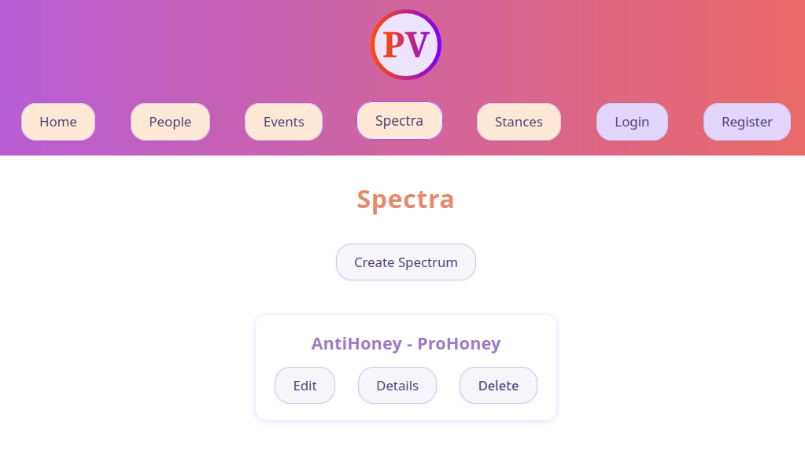
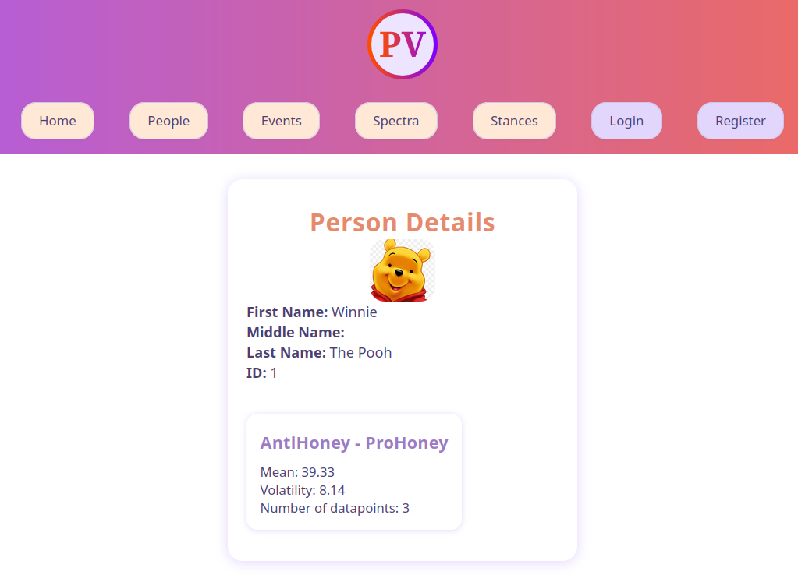

# PolVol

Sample project of online platform.

## Concept

User (with necessary authorization) can add 3 base data components:

- Person
- Event
- Spectrum (for example "conservative - liberal")

Next these elements can be linked via Stance (stance of a person on an event) which can be described as Scores within a Spectrum (from -50 to 50, where -50 in example above would be extremely conservative and 50 would be extremely liberal). Later average Scores with standard deviation for each Spectrum for each Person can be viewed in person's details page. This (in theory) should objectively show how extreme (average score) and consistent (standard deviation) the person is in their stance withing given spectrum.

### Example for Winnie The Pooh

Based on three stances Winnie shared on two events, we can see that's he's very ProHoney (39/50, unsurprisingly he's near extremist).

People:


Events:


Spectra:


Stances:


Winnie The Pooh Details:


## Tech Stack

| Component | Technology |
| --------- | ---------- |
| Frontend  | React      |
| Backend   | FastApi    |
| Database  | SQLite     |

## Requirements

- npm 9.2.0
  - react 19.1.0
  - react-dom 19.1.0
  - react-router 7.6.3
  - react-router-dom 7.6.3
  - vite 7.0.4
- Python 3.12.11
  - pydantic 2.11.7
  - FastApi 0.112.2
  - SQLAlchemy 2.0.41
- Docker [not yet implemented]

## Frontend

React frontend created with Vite. `src` directory is devided by views for specific views and data models (eg. `src/Header` for navigation and header, `src/Login` for user login and registration, `src/Person` for CRUD operations on Person data model). Reusable components have been created in `src/shared` directory to keepthe style consistent across all views and to minimize code repetitions (mostly css). This react app is using React Router to redirect to specific views/components.

## Backend

Python FastApi api handling all CRUD operations on different data models, authentication, generating and removing JSON Web Tokens (JWT).
It is using Pydantic data models to verify body of the request.

## Database

SQLite database created with Python SQLAlchemy. For each database data model there is matching Pydantic model for validation (`backend.src.models.PersonDB` -> `backend.src.models_validators.Person` etc.).

## Authorization and Authentication

Authentication is managed by JWT. Token are automatically removed from database after their expiration datetime is exceeded (via celery scheduled job [not yet implemented]). Authorization is devided into 4 levels specified in `backend.src.models_validators.Authorizations`:

```python
class Authorizations(Enum):
    ADMIN = "admin"  # all permissions, assigning autorhizations to other users
    DATA_ANALYST = "data_analyst"  # all below + CU on stances
    DATA_PROVIDER = "data_provider"  # all below + CU events, spectra, people
    GUEST = "guest"  # R all
```

After user registers for a specific authorization level, another user of higher level has to approve him.
Users with higher level of authorization can change status of users with lower level of authorizations and can remove their account


Until approved, user has lowest authorization level (guest). [not yet implemented]

## Launching (temporary, until deployed to Azure)

No volumes for database and logs yet. Will be done later.

Build docker image:

```bash
cd backend
docker build -t backend:0.0.1
```

Run api:

```bash
docker run -p 8000:8000 backend:0.0.1
# or docker run -d -p 800:8000 backend:0.0.1
```

Run forntend in terminal:

This will be changed to docker as well.

```bash
cd frontend
npm install
npm run build
serve -s dist
```

## Background Jobs [might be changed to Celery + Redis]

Currently there is one background job `backend.src.automation.clear_tokens` implemented running every 2 minutes. It is removing outdated tokens from the database. The job is setup using [schedule](https://pypi.org/project/schedule/) package in Python.

## DevOps (GitHub Actions)

not yet implemented

## Containerization (Docker)

not yet implemented

## Cloud (Azure)

not yet implemented

## LLM (Ollama / HuggingFace)

not yet implemented
